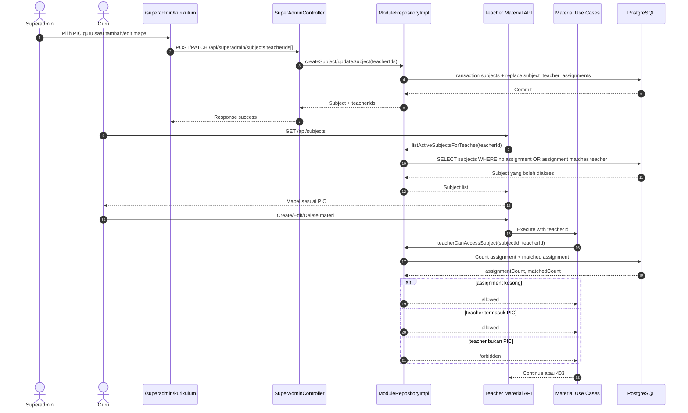

<!--
Tujuan: Mendokumentasikan sequence assignment PIC guru pada kurikulum.
Caller: SYSTEM_MAP.md, developer, dan sesi validasi fitur kurikulum.
Dependensi: Superadmin kurikulum route, SuperAdminController, ModuleRepositoryImpl, subject_teacher_assignments, Teacher material endpoints.
Main Functions: Menjelaskan rule PIC kosong = semua guru dan enforcement akses guru saat list/create/update/delete materi.
Side Effects: Dokumentasi saja; tidak ada DB write, HTTP call, atau file I/O runtime.
-->

# Curriculum Teacher PIC Sequence

