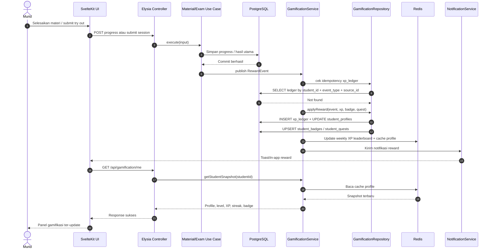

<!--
Tujuan: Menggambarkan sequence reward gamifikasi dari aktivitas belajar/ujian sampai XP, quest, badge, notifikasi, dan dashboard murid ter-update.
Caller: Developer backend/frontend dan reviewer yang mengimplementasikan modul gamifikasi.
Dependensi: lms-bimbel-docs/docs/gamification.md, material progress flow, exam grading flow, NotificationService, PostgreSQL, dan Redis.
Main Functions: Menjelaskan urutan Material/Exam Use Case, RewardEvent, GamificationService, repository, notification, dan frontend refresh.
Side Effects: Dokumentasi diagram saja; tidak ada DB write, HTTP call, atau file I/O runtime.
-->

# Gamification Reward Sequence

