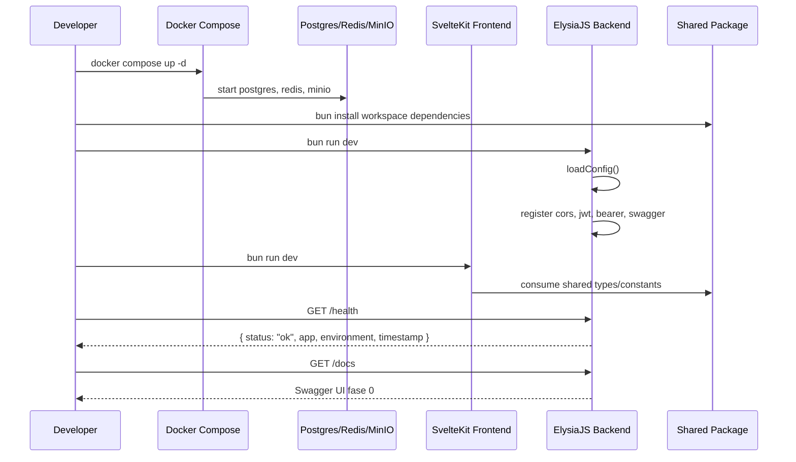

<!--
Tujuan: Mendokumentasikan sequence diagram fase 0 agar alur bootstrap dan health check mudah dipindai tim.
Caller: Developer, reviewer, dan sesi implementasi lanjutan.
Dependensi: Struktur scaffold fase 0 pada backend, frontend, Docker, dan shared package.
Main Functions: Menjelaskan urutan start infrastruktur, bootstrap backend/frontend, dan request health endpoint.
Side Effects: Dokumentasi saja; tidak ada efek runtime.
-->

# Sequence Diagram Fase 0

