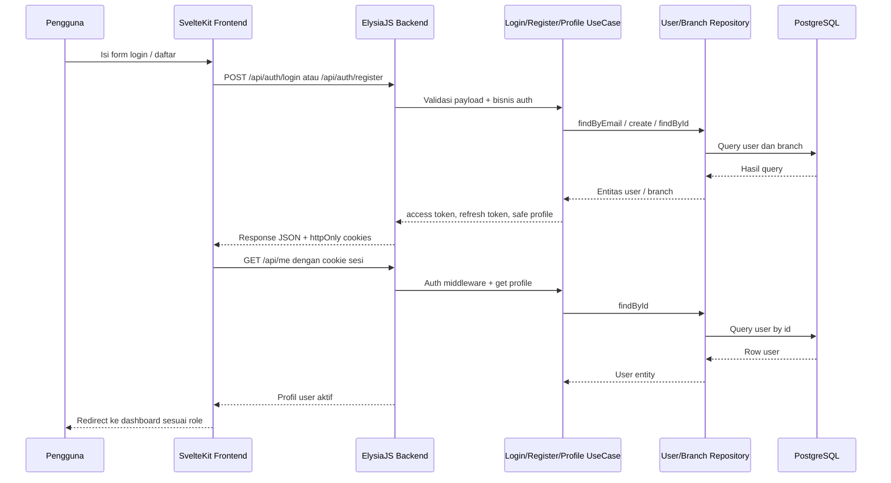

<!--
Tujuan: Mendokumentasikan sequence diagram fase 1 untuk alur login, sesi cookie, dan akses profil.
Caller: Developer, reviewer, dan sesi implementasi lanjutan auth/user.
Dependensi: Backend auth controller, auth middleware, frontend login, dan role guard server-side.
Main Functions: Menjelaskan urutan login sampai protected route dapat diakses berdasarkan role.
Side Effects: Dokumentasi saja; tidak ada efek runtime.
-->

# Sequence Diagram Fase 1

