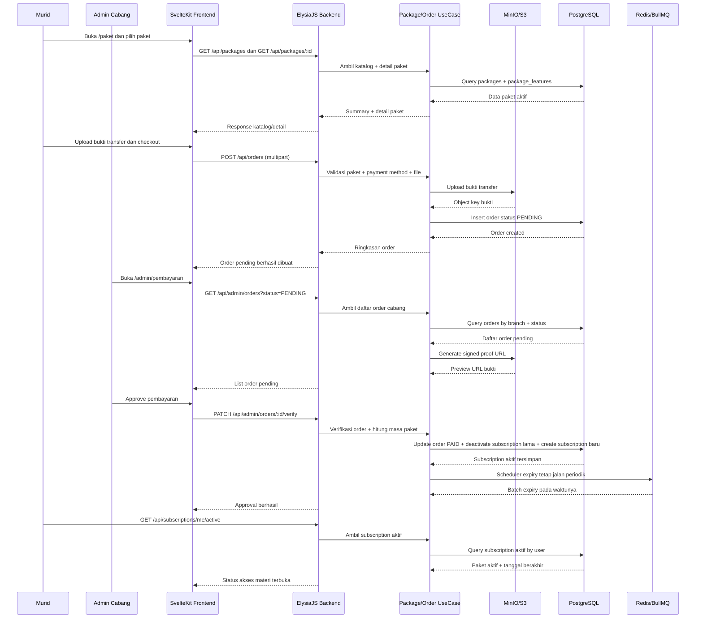

<!--
Tujuan: Mendokumentasikan sequence diagram fase 2 untuk alur katalog paket, checkout, verifikasi admin, dan aktivasi subscription.
Caller: Developer, reviewer, dan sesi implementasi lanjutan paket/pembayaran.
Dependensi: Package controller, order controller, admin order controller, object storage, dan subscription repository.
Main Functions: Menjelaskan urutan dari pemilihan paket sampai langganan murid aktif setelah admin approve pembayaran.
Side Effects: Dokumentasi saja; tidak ada efek runtime.
-->

# Sequence Diagram Fase 2

