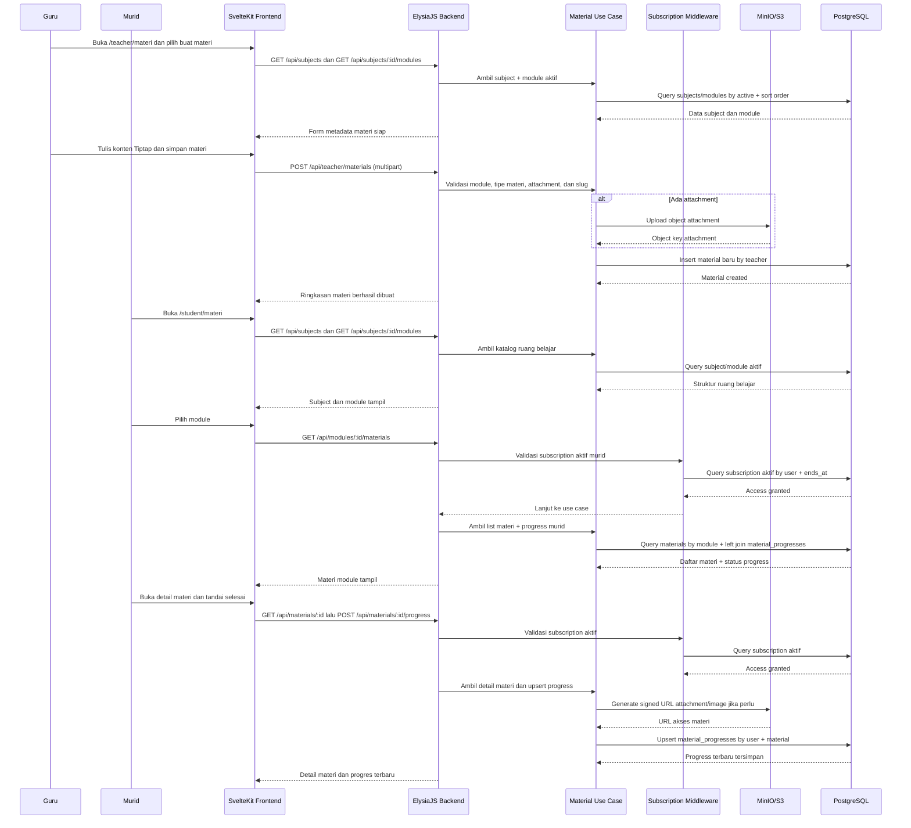

<!--
Tujuan: Mendokumentasikan sequence diagram fase 3 untuk alur ruang belajar guru, akses materi murid, dan progress belajar.
Caller: Developer, reviewer, dan sesi implementasi lanjutan modul ruang belajar.
Dependensi: Teacher material controller, material controller, subscription middleware, object storage, dan repository learning.
Main Functions: Menjelaskan urutan create materi guru, akses materi murid dengan subscription aktif, dan update progress material.
Side Effects: Dokumentasi saja; tidak ada efek runtime.
-->

# Sequence Diagram Fase 3

