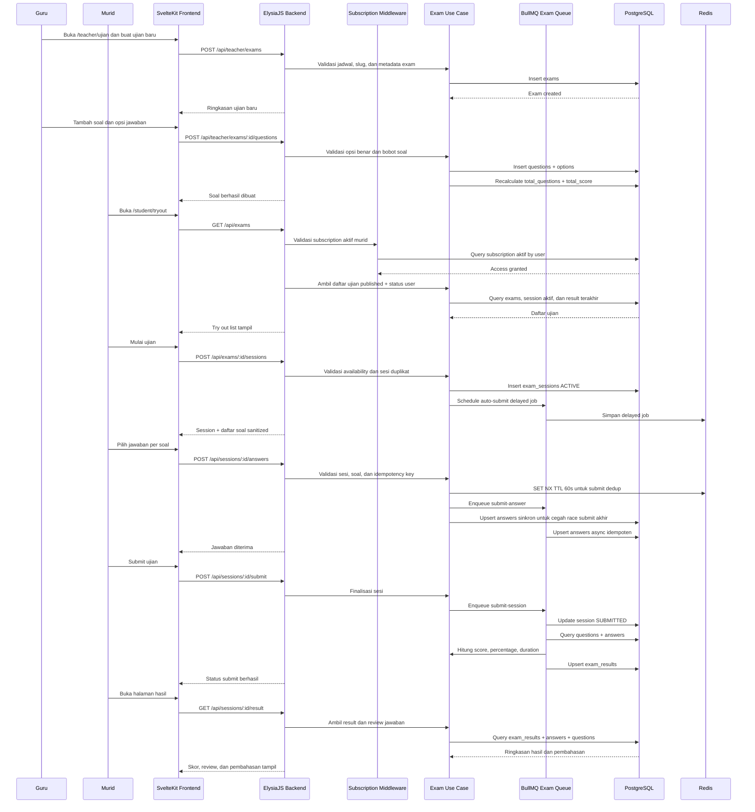

<!--
Tujuan: Mendokumentasikan sequence diagram fase 4 untuk teacher exam management, sesi ujian murid, submit jawaban, grading, dan hasil.
Caller: Developer, reviewer, dan sesi implementasi lanjutan modul try out.
Dependensi: Teacher exam controller, exam controller, exam processing queue, subscription middleware, dan repository exam.
Main Functions: Menjelaskan alur create ujian, create soal, start session, submit jawaban, submit akhir, dan perhitungan hasil.
Side Effects: Dokumentasi saja; tidak ada efek runtime.
-->

# Sequence Diagram Fase 4

