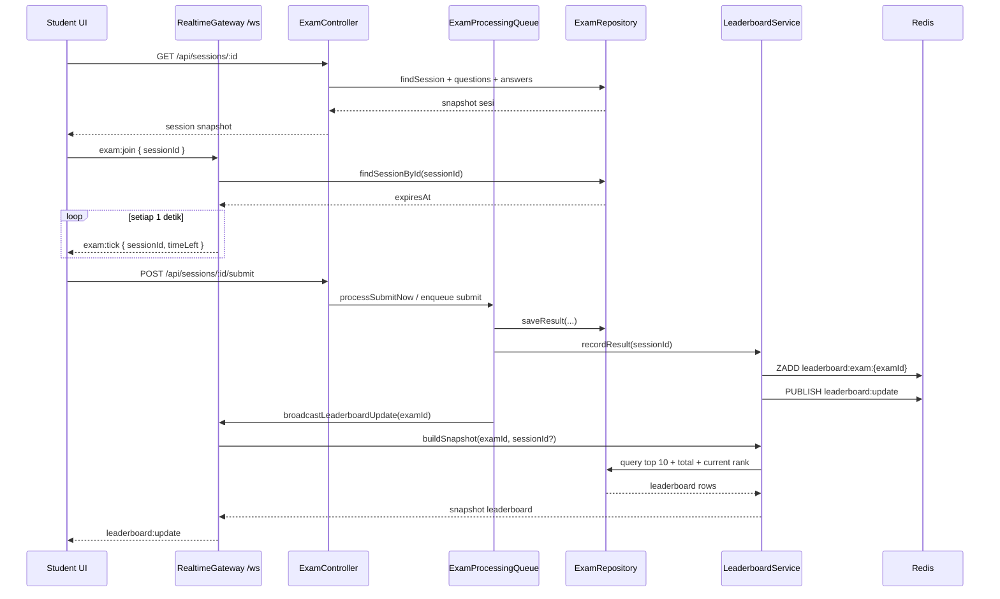

<!--
Tujuan: Mendokumentasikan sequence diagram fase 5 untuk timer sinkron ujian dan leaderboard realtime.
Caller: Developer, reviewer, dan sesi Codex berikutnya saat menelusuri implementasi fase 5.
Dependensi: Implementasi backend/frontend fase 5, SYSTEM_MAP.md, dan docs fase proyek.
Main Functions: Menjelaskan alur join WebSocket, tick timer, submit ujian, grading, cache Redis, dan broadcast leaderboard.
Side Effects: Dokumentasi saja; tidak ada DB write, HTTP call, atau file I/O runtime.
-->

# Phase 5 — Realtime Timer & Leaderboard

