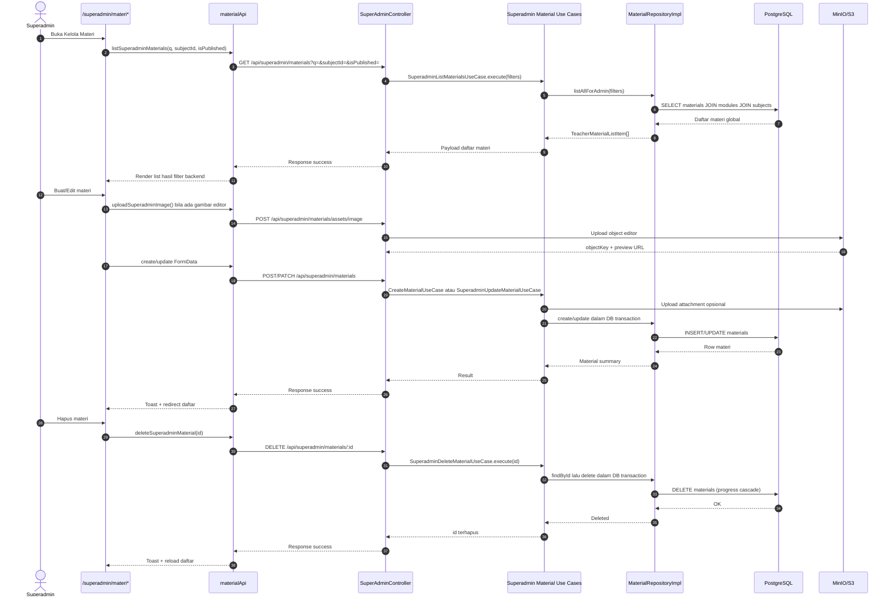

<!--
Tujuan: Mendokumentasikan sequence Kelola Materi Superadmin.
Caller: SYSTEM_MAP.md, developer, dan sesi validasi fitur materi admin.
Dependensi: SvelteKit superadmin routes, materialApi, SuperAdminController, Superadmin material use cases, MaterialRepositoryImpl, PostgreSQL, MinIO/S3.
Main Functions: Menjelaskan alur list, create/update, upload asset, dan delete materi global.
Side Effects: Dokumentasi saja; tidak ada DB write, HTTP call, atau file I/O runtime.
-->

# Superadmin Material Management Sequence

